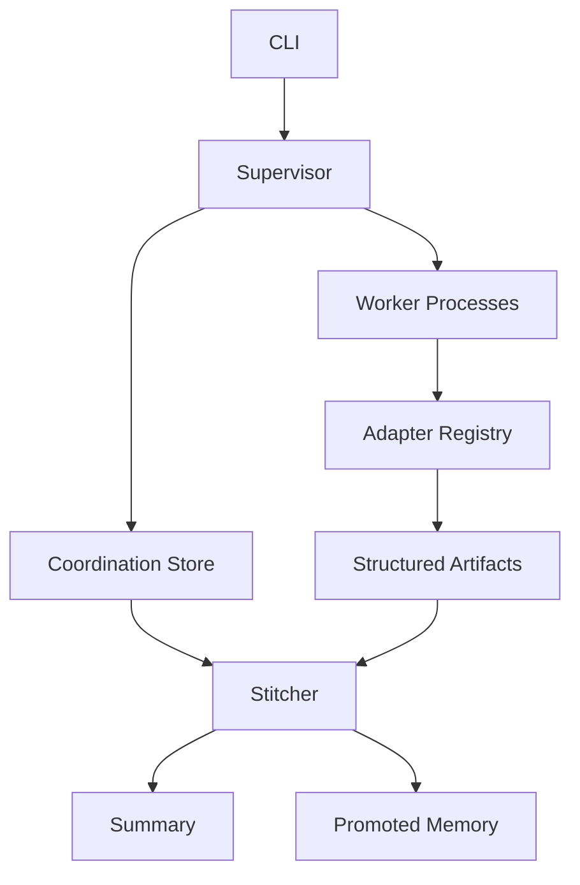

# Architecture

Puppetmaster treats agent swarms like distributed systems rather than group chats.



## Core Objects

- `Job`: one swarm run and user goal.
- `Task`: a role-specific unit of work, optionally dependent on other tasks.
- `AgentRun`: one attempt by one worker process.
- `Artifact`: structured worker output with evidence, payload, `sha256`, legacy `confidence`, and explicit statuses (`execution_status` / `grounding_status` / `claim_support_status` / `criterion_status` / `worker_self_rating`). See [ARTIFACT_STATUS.md](ARTIFACT_STATUS.md).
- `MemoryRecord`: promoted facts that future workers can retrieve.

## Runtime Flow

1. The CLI creates a `Job`.
2. The supervisor creates a task DAG.
3. Downstream tasks start as `blocked`.
4. Worker subprocesses claim ready tasks with leases.
5. Long-running workers heartbeat and renew leases.
6. Workers emit structured artifacts.
7. Stale leases can be recovered back to `queued`.
8. The stitcher reads artifacts only and writes `stitched.md`.

## Backends

The default backend is SQLite with WAL enabled. It stores jobs, tasks, runs, artifacts, memory, and events in the resolved Puppetmaster state directory.

Named cells (v1.22.24) sit **beside** that store as `<state>/cells/<id>.sqlite` files: serial inbox, hibernate flag, and next alarm. They reuse the lease idea from tasks; they do not replace SwarmStore or task claiming.

By default that directory is outside the target repository, under per-user app state:

```text
macOS: ~/Library/Application Support/puppetmaster/projects/<workspace>-<hash>/
Linux: ~/.local/state/puppetmaster/projects/<workspace>-<hash>/
```

Use `python -m puppetmaster state` to print the resolved path. Use `--state-dir` or `PUPPETMASTER_STATE_DIR` when you intentionally want a different location, such as CI state or explicit repo-local `.puppetmaster/`.

The file backend remains useful for debugging because every object is a readable JSON file.


## Command plane (unreleased; tip 1.27.5)

Send / steer / interrupt / respond_input are durable **session commands** the
host executes (`puppetmaster.session_commands`). Entries live under
`<state>/command-ledgers/<job_id>.jsonl` with a processed-id set. Evaluation is
pure (dedupe → TTL → supersede → execute) and **marks processed before
execute** so crash recovery stays idempotent.

| Kind | Maps to |
| --- | --- |
| `run` | Task / artifact admission |
| `steer` | Follow-up instruction (planner / enqueue) |
| `interrupt` | Scoped durable cancellation |
| `respond_input` | Answer a pending gate / question |

Run journals (`puppetmaster.run_journal`) sit beside liveness: a mid-stream
journal is stamped `aborted` on `host.recovered`. Resume attempts are budgeted
so auto-revive cannot loop forever.

WorkspaceScope (`puppetmaster.workspace_scope`) freezes the primary store root
for the engine process. Auth / profile / `--state-dir` changes must not silently
swap roots mid-process; cross-project attach remains allowed.

## Headless engine honesty

MCP and CLI are the orchestration **engine**. Marionette, Automaton, and Discord
OS are **viewports** — they may start and supervise jobs, but they must not own
command-ledger / run-journal / lease truth that belongs in the store.

Research notes: [research/harness.md](research/harness.md),
[research/acp.md](research/acp.md),
[research/orchestration-durability.md](research/orchestration-durability.md).

## Failure Model

Workers are allowed to die. The lease expires, the task becomes recoverable, and another worker can reclaim it. The crash demo exercises this path.

```bash
python -m puppetmaster crash-demo
```

## Design Rules

- Workers do not communicate directly.
- Durable state goes through the coordination store.
- Final synthesis reads artifacts, not transcripts. Recall across jobs with `effort-index` (compact refs; `rollup` stays the cost ledger). A later model reads the portable working set (`artifact_index.json` + SQLite); it does not inherit another model's provider KV cache.
- Artifacts require evidence and type-specific payload fields.
- Optional providers must fail as structured artifacts, not runtime crashes.

